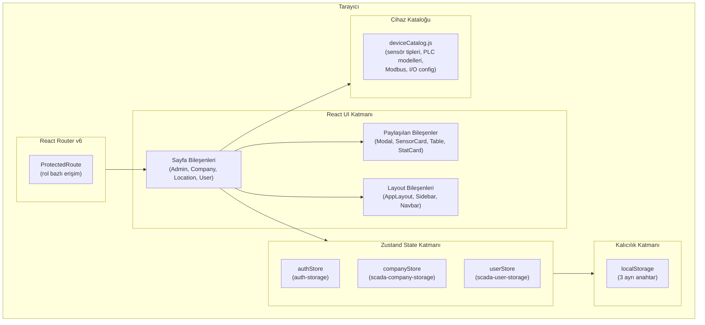
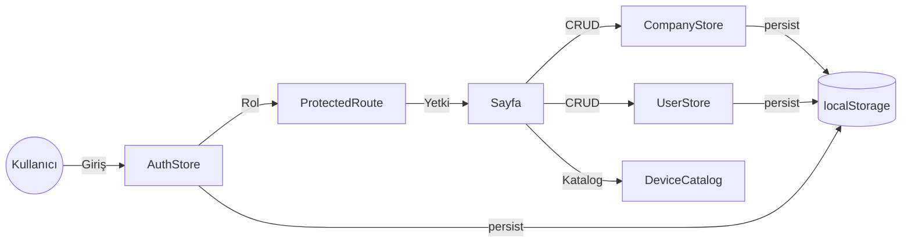
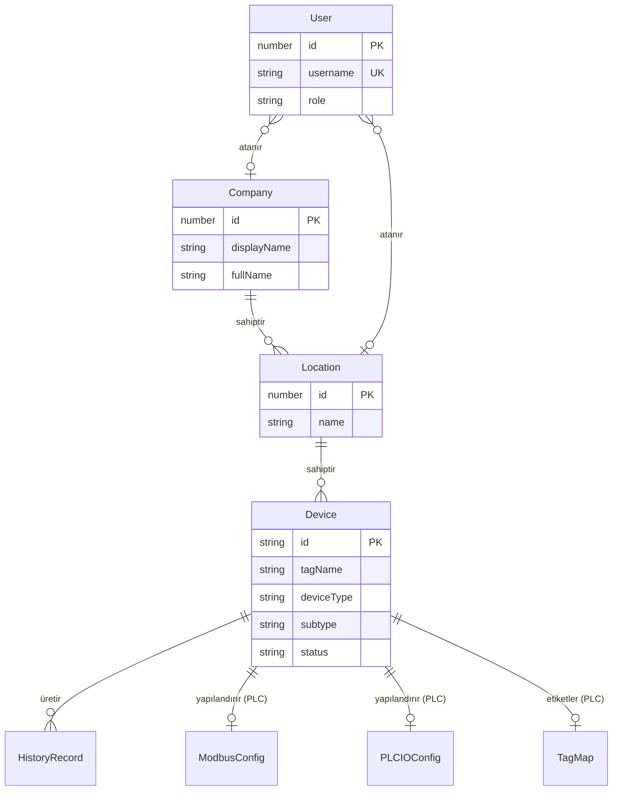
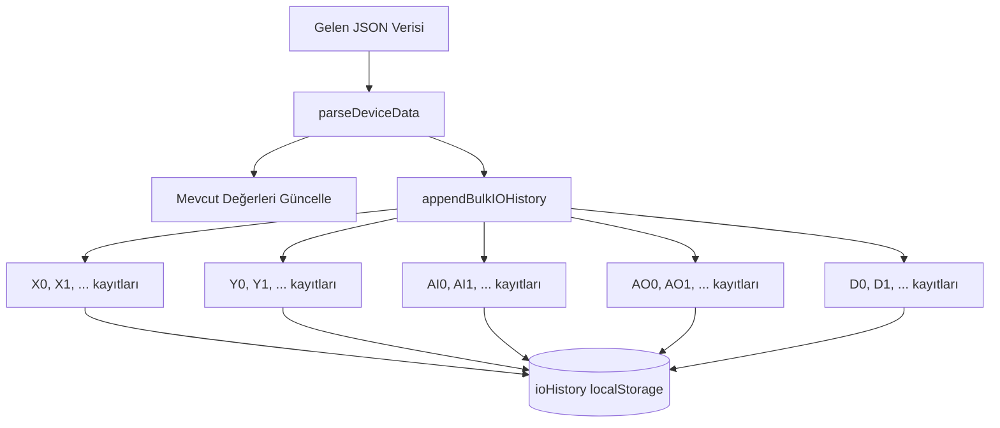
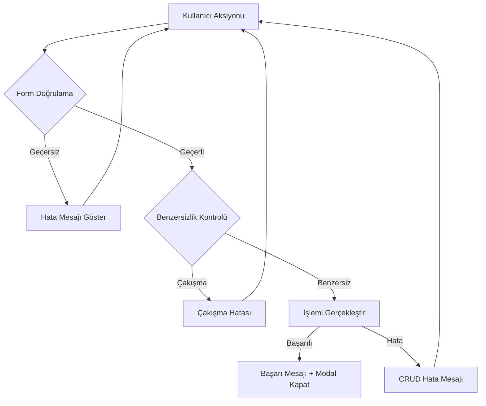

# Tasarım Belgesi: SCADA UI Professional

## Genel Bakış

Bu tasarım belgesi, mevcut SCADA UI uygulamasının profesyonel seviyeye taşınması için gerekli mimari kararları, bileşen yapısını, veri modellerini ve test stratejisini tanımlar. Uygulama React + Vite + TailwindCSS + Zustand teknoloji yığını üzerine kuruludur ve çok kiracılı (multi-tenant) bir SCADA dashboard olarak Firma → Lokasyon → Cihaz hiyerarşisini yönetir.

Mevcut kod tabanı incelendiğinde, temel yapı (auth store, company store, user store, device catalog, routing, layout) zaten mevcuttur. Bu tasarım, eksik modüllerin (PLC I/O yapılandırma UI, tag yönetimi UI, gelişmiş geçmiş veri yönetimi, arama/filtreleme iyileştirmeleri) eklenmesini ve mevcut yapının güçlendirilmesini kapsar.

### Temel Tasarım Kararları

1. **State yönetimi**: Zustand persist middleware ile localStorage — mevcut yapı korunur
2. **Routing**: React Router v6 ile rol bazlı korumalı rotalar — mevcut `ProtectedRoute` genişletilir
3. **UI**: TailwindCSS utility-first yaklaşımı — mevcut bileşen kalıpları korunur
4. **Veri katmanı**: Mock data + localStorage (backend-ready yapı) — mevcut `companyStore` genişletilir
5. **Cihaz kataloğu**: `deviceCatalog.js` merkezi kaynak olarak korunur ve genişletilir

## Mimari

### Üst Düzey Mimari



### Veri Akış Diyagramı




## Bileşenler ve Arayüzler

### Dizin Yapısı

```
src/
├── app/
│   └── ProtectedRoute.jsx          # Rol bazlı rota koruması (mevcut, güncellenir)
├── components/
│   ├── Layout/
│   │   ├── AppLayout.jsx            # Ana layout (mevcut)
│   │   ├── Navbar.jsx               # Üst navigasyon (mevcut)
│   │   └── Sidebar.jsx              # Sol menü (mevcut)
│   ├── Modal.jsx                    # Genel modal (mevcut)
│   ├── SensorCard.jsx               # Sensör kartı (mevcut)
│   ├── StatCard.jsx                 # İstatistik kartı (mevcut)
│   ├── Table.jsx                    # Genel tablo (mevcut)
│   ├── SearchInput.jsx              # Yeniden kullanılabilir arama kutusu (YENİ)
│   ├── ConfirmDialog.jsx            # Onay/şifre doğrulama dialogu (YENİ)
│   └── FormField.jsx                # Form alanı + hata mesajı wrapper (YENİ)
├── features/
│   ├── auth/
│   │   └── authStore.js             # Kimlik doğrulama store (mevcut, güncellenir)
│   ├── company/
│   │   └── companyStore.js          # Firma/lokasyon/cihaz store (mevcut, genişletilir)
│   ├── device/
│   │   └── deviceCatalog.js         # Cihaz kataloğu (mevcut)
│   └── users/
│       └── userStore.js             # Kullanıcı store (mevcut)
├── hooks/
│   ├── useAuth.js                   # Auth hook (mevcut)
│   ├── useSearch.js                 # Arama/filtreleme hook (YENİ)
│   └── useFormValidation.js         # Form doğrulama hook (YENİ)
├── pages/
│   ├── Admin/
│   │   ├── AdminDashboard.jsx       # Admin dashboard (mevcut, güncellenir)
│   │   ├── AdminCompanies.jsx       # Firma listesi (mevcut, güncellenir)
│   │   ├── AdminCompanyDetail.jsx   # Firma detay (mevcut, güncellenir)
│   │   ├── AdminDevices.jsx         # Cihaz listesi (mevcut)
│   │   ├── AdminDeviceHistory.jsx   # Cihaz geçmişi (mevcut, güncellenir)
│   │   ├── AdminUsers.jsx           # Kullanıcı yönetimi (mevcut, güncellenir)
│   │   └── adminMenu.jsx            # Admin menü tanımı (mevcut)
│   ├── Company/
│   │   ├── CompanyDashboard.jsx     # Firma yöneticisi dashboard (mevcut)
│   │   └── CompanyDeviceHistory.jsx # Firma cihaz geçmişi (mevcut)
│   ├── Location/
│   │   ├── LocationDashboard.jsx    # Lokasyon yöneticisi dashboard (mevcut)
│   │   └── LocationDeviceHistory.jsx
│   ├── User/
│   │   ├── UserDashboard.jsx        # Kullanıcı dashboard (mevcut)
│   │   └── UserDeviceHistory.jsx
│   ├── shared/
│   │   └── DeviceHistoryPage.jsx    # Paylaşılan geçmiş veri sayfası (mevcut, güncellenir)
│   └── Unauthorized.jsx             # Yetkisiz erişim sayfası (mevcut)
├── App.jsx                          # Ana routing (mevcut)
├── main.jsx                         # Giriş noktası (mevcut)
└── index.css                        # Global stiller (mevcut)
```

### Bileşen Arayüzleri

#### SearchInput (YENİ)

```jsx
// Props: { value, onChange, placeholder, onClear }
// Arama kutusu + temizleme (X) butonu
// Her tuş vuruşunda onChange tetiklenir
// Boş olduğunda tüm kayıtlar gösterilir
```

#### ConfirmDialog (YENİ)

```jsx
// Props: { title, message, onConfirm, onCancel, requirePassword?, onPasswordVerify? }
// Silme işlemleri için onay dialogu
// requirePassword=true ise şifre alanı gösterir
// Admin geçmiş veri silme işleminde kullanılır
```

#### FormField (YENİ)

```jsx
// Props: { label, error, required, children }
// Form alanı wrapper — hata mesajını kırmızı renkte gösterir
// Zorunlu alan işareti (*) gösterir
```

#### useSearch Hook (YENİ)

```jsx
// useSearch(items, searchFields, query)
// items: filtrelenecek dizi
// searchFields: aranacak alan isimleri dizisi
// query: arama metni
// Döner: filtrelenmiş dizi (case-insensitive, anlık)
```

#### useFormValidation Hook (YENİ)

```jsx
// useFormValidation(rules)
// rules: { fieldName: (value) => errorMessage | null }
// Döner: { errors, validate, clearErrors, isValid }
```

### Routing Yapısı

Mevcut routing yapısı korunur. Tüm rotalar `ProtectedRoute` ile sarılıdır:

| Rota | Rol | Sayfa |
|------|-----|-------|
| `/login` | Herkese açık | LoginPage |
| `/unauthorized` | Herkese açık | Unauthorized |
| `/admin/dashboard` | admin | AdminDashboard |
| `/admin/companies` | admin | AdminCompanies |
| `/admin/companies/:id` | admin | AdminCompanyDetail |
| `/admin/users` | admin | AdminUsers |
| `/admin/devices` | admin | AdminDevices |
| `/admin/device/:deviceId` | admin | AdminDeviceHistory |
| `/company/dashboard` | company_manager | CompanyDashboard |
| `/company/device/:deviceId` | company_manager | CompanyDeviceHistory |
| `/location/dashboard` | location_manager | LocationDashboard |
| `/location/device/:deviceId` | location_manager | LocationDeviceHistory |
| `/user/dashboard` | user | UserDashboard |
| `/user/device/:deviceId` | user | UserDeviceHistory |

### RBAC Erişim Matrisi

| Modül | admin | company_manager | location_manager | user |
|-------|-------|-----------------|------------------|------|
| Firma CRUD | ✅ Tam | ❌ | ❌ | ❌ |
| Lokasyon CRUD | ✅ Tam | ❌ | ❌ | ❌ |
| Cihaz CRUD | ✅ Tam | ❌ | ❌ | ❌ |
| Kullanıcı CRUD | ✅ Tam | ❌ | ❌ | ❌ |
| PLC Modbus/IO Config | ✅ Tam | ❌ | ❌ | ❌ |
| Tag Düzenleme | ✅ Tam | ❌ | ❌ | ❌ |
| Tag Görüntüleme | ✅ | ✅ (kendi firması) | ✅ (kendi lokasyonu) | ✅ (salt okunur) |
| Dashboard | ✅ Tüm veriler | ✅ Kendi firması | ✅ Kendi lokasyonu | ✅ Kendi lokasyonu |
| Cihaz Geçmişi | ✅ Tam + Silme | ✅ Kendi firması | ✅ Kendi lokasyonu | ✅ Salt okunur |
| Geçmiş Silme | ✅ (şifre ile) | ❌ | ❌ | ❌ |


## Veri Modelleri

### Temel Veri Yapıları

Mevcut store yapısı korunarak genişletilir. Aşağıda tüm veri modelleri tanımlanmıştır:

#### User (Kullanıcı)

```javascript
{
  id: number,              // Benzersiz ID (Date.now() ile üretilir)
  username: string,        // Benzersiz kullanıcı adı
  name: string,            // Ad soyad
  role: 'admin' | 'company_manager' | 'location_manager' | 'user',
  companyId: number | null,   // Atandığı firma (admin için null)
  locationId: number | null,  // Atandığı lokasyon (admin/company_manager için null)
}
```

#### AuthSession (Oturum)

```javascript
{
  user: {                  // Şifre hariç kullanıcı bilgisi
    id: number,
    username: string,
    name: string,
    role: string,
    companyId?: number,
    locationId?: number,
  },
  token: string,           // Mock token ("mock-token-{id}")
  isAuthenticated: boolean,
}
```

#### Company (Firma)

```javascript
{
  id: number,              // Benzersiz ID (Date.now() ile üretilir)
  displayName: string,     // Görünen ad (zorunlu)
  fullName: string,        // Tam ad (zorunlu)
  managers: string[],      // Firma yöneticisi kullanıcı adları
  locations: Location[],   // Firmaya bağlı lokasyonlar
}
```

#### Location (Lokasyon)

```javascript
{
  id: number,              // Benzersiz ID
  name: string,            // Lokasyon adı (zorunlu)
  managers: string[],      // Lokasyon yöneticisi kullanıcı adları
  users: string[],         // Lokasyona atanmış kullanıcı adları
  devices: Device[],       // Lokasyona bağlı cihazlar
}
```

#### Device (Cihaz) — Genişletilmiş

```javascript
{
  id: string,              // Otomatik sıralı ID ("DEV-001", "DEV-002", ...)
  tagName: string,         // Cihaz tag ismi
  deviceType: 'sensor' | 'plc',  // Cihaz tipi
  subtype: string,         // Alt tip (ör: 'temperature', 'dvp_es2')
  value: number,           // Son ölçüm değeri (sensör için)
  unit: string,            // Birim (katalogdan otomatik)
  timestamp: string,       // ISO 8601 zaman damgası
  status: 'online' | 'offline',  // Cihaz durumu

  // PLC'ye özel alanlar (deviceType === 'plc' ise)
  modbusConfig?: ModbusConfig,
  ioConfig?: PLCIOConfig,
  tags?: TagMap,           // I/O noktalarına atanmış tag isimleri
}
```

#### ModbusConfig (Modbus Yapılandırması)

```javascript
{
  slaveId: number,         // 1-247 aralığı
  baudRate: number,        // 1200, 2400, 4800, 9600, 19200, 38400, 57600, 115200
  dataBits: 7 | 8,
  stopBits: 1 | 2,
  parity: 'none' | 'even' | 'odd',
}
```

#### PLCIOConfig (PLC I/O Yapılandırması)

```javascript
{
  digitalInputs: {
    count: number,         // 0, 8, 16, 24, 32, 40, 48, 64
  },
  digitalOutputs: {
    count: number,         // 0, 6, 14, 22, 30, 38, 46, 54
  },
  analogInputs: [          // Dinamik ekleme/silme
    { channel: number, dataType: DataType }
  ],
  analogOutputs: [         // Dinamik ekleme/silme
    { channel: number, dataType: DataType }
  ],
  dataRegister: {
    start: number,         // Başlangıç adresi (ör: 0)
    end: number,           // Bitiş adresi (ör: 100)
    dataType: DataType,
  },
}

// DataType: 'word' | 'dword' | 'unsigned' | 'udword' | 'float'
```

#### TagMap (Tag İsimleri)

```javascript
{
  // Her I/O noktası adresi için tag ismi
  // Örnek: { "X0": "Start Butonu", "Y0": "Motor Çıkışı", "AI0": "Sıcaklık Girişi" }
  [address: string]: string
}
```

#### HistoryRecord (Geçmiş Kayıt)

```javascript
{
  id: string,              // "{deviceId}-H-{index}"
  value: number,           // Ölçüm değeri
  unit: string,            // Birim
  timestamp: string,       // ISO 8601 zaman damgası
}
```

### State Store Yapısı

#### authStore (auth-storage)

```javascript
{
  user: User | null,
  token: string | null,
  isAuthenticated: boolean,
  login: (username, password) => string,  // Yönlendirme yolu döner
  logout: () => void,
}
```

#### companyStore (scada-company-storage)

```javascript
{
  companies: Company[],
  deviceHistory: { [deviceId: string]: HistoryRecord[] },

  // Firma CRUD
  addCompany: (company) => void,
  updateCompany: (id, data) => void,
  deleteCompany: (id) => void,

  // Lokasyon CRUD
  addLocation: (companyId, location) => void,
  updateLocation: (companyId, locationId, data) => void,
  deleteLocation: (companyId, locationId) => void,

  // Cihaz CRUD
  addDevice: (companyId, locationId, device) => void,
  updateDevice: (companyId, locationId, deviceId, data) => void,
  deleteDevice: (companyId, locationId, deviceId) => void,
  toggleDeviceStatus: (companyId, locationId, deviceId) => void,

  // Geçmiş Veri
  appendHistory: (deviceId, record) => void,
  clearHistory: (deviceId) => void,
  deleteHistoryRange: (deviceId, fromTs, toTs) => void,

  // Yardımcı
  peekNextDeviceId: () => string,
}
```

#### userStore (scada-user-storage)

```javascript
{
  users: User[],
  addUser: (user) => void,       // Kullanıcı adı çakışması kontrolü yapar
  updateUser: (id, data) => void,
  deleteUser: (id) => void,
}
```

### Hiyerarşik Veri İlişkileri



### localStorage Anahtar Yapısı

| Anahtar | Store | İçerik |
|---------|-------|--------|
| `auth-storage` | authStore | Oturum bilgileri (user, token, isAuthenticated) |
| `scada-company-storage` | companyStore | Firmalar, lokasyonlar, cihazlar, cihaz geçmişi |
| `scada-user-storage` | userStore | Kullanıcı listesi |

### Delta DVP Adres Üretim Kuralları

Mevcut `deviceCatalog.js` içindeki `getDeltaXAddresses` ve `getDeltaYAddresses` fonksiyonları oktal gruplama kuralını uygular:

- **X adresleri**: X0-X7, X20-X27, X30-X37, X40-X47... (ilk grup 8, sonraki gruplar 8'er)
- **Y adresleri**: Y0-Y5, Y20-Y27, Y30-Y37, Y40-Y47... (ilk grup 6, sonraki gruplar 8'er)
- **AI adresleri**: AI0, AI1, AI2... (sıralı)
- **AO adresleri**: AO0, AO1, AO2... (sıralı)
- **D adresleri**: D{start}-D{end} (yapılandırılabilir aralık)


## Doğruluk Özellikleri (Correctness Properties)

*Bir doğruluk özelliği (property), sistemin tüm geçerli çalışma durumlarında doğru olması gereken bir davranış veya karakteristiktir. Property'ler, insan tarafından okunabilir spesifikasyonlar ile makine tarafından doğrulanabilir doğruluk garantileri arasında köprü görevi görür.*

### Property 1: Login/Logout Round-Trip

*Herhangi bir* geçerli kullanıcı adı ve şifre çifti için, login fonksiyonu çağrıldığında state'te `isAuthenticated: true` olmalı ve kullanıcının rolüne uygun yönlendirme yolu dönmelidir. Ardından logout çağrıldığında `isAuthenticated: false`, `user: null` ve `token: null` olmalıdır.

**Validates: Requirements 1.1, 1.3**

### Property 2: Geçersiz Kimlik Bilgileri Reddi

*Herhangi bir* kullanıcı adı ve şifre çifti için, eğer bu çift geçerli kullanıcılar listesinde yoksa, login fonksiyonu hata fırlatmalı ve state değişmemelidir.

**Validates: Requirements 1.2**

### Property 3: Oturum Nesnesinde Şifre Bulunmaması

*Herhangi bir* başarılı login işlemi sonrasında, state'teki `user` nesnesinde `password` alanı bulunmamalıdır.

**Validates: Requirements 1.4**

### Property 4: Rol Bazlı Erişim Kontrolü

*Herhangi bir* kullanıcı ve *herhangi bir* korumalı rota için, kullanıcının rolü rotanın `allowedRoles` listesinde yoksa, erişim reddedilmeli ve `/unauthorized` sayfasına yönlendirme yapılmalıdır. Oturum açmamış kullanıcılar ise `/login` sayfasına yönlendirilmelidir.

**Validates: Requirements 2.2, 2.3**

### Property 5: Rol Bazlı Veri Kapsamı

*Herhangi bir* `company_manager` kullanıcısı için erişebildiği veriler yalnızca atandığı firmaya ait olmalıdır. *Herhangi bir* `location_manager` veya `user` rolündeki kullanıcı için erişebildiği veriler yalnızca atandığı lokasyona ait olmalıdır.

**Validates: Requirements 2.5, 2.6, 2.7, 12.3, 12.4**

### Property 6: Entity Ekleme Benzersiz ID Garantisi

*Herhangi bir* firma, lokasyon veya cihaz ekleme işlemi sonrasında, eklenen entity'nin ID'si mevcut tüm entity'lerin ID'lerinden farklı olmalıdır. Cihazlar için ID formatı `DEV-XXX` (sıralı, 3 haneli) olmalıdır.

**Validates: Requirements 3.2, 4.1, 5.2**

### Property 7: Kaskad Silme Bütünlüğü

*Herhangi bir* firma silindiğinde, o firmaya bağlı tüm lokasyonlar ve cihazlar da state'ten kaldırılmalıdır. *Herhangi bir* lokasyon silindiğinde, o lokasyona bağlı tüm cihazlar da kaldırılmalıdır.

**Validates: Requirements 3.4, 4.3**

### Property 8: CRUD Güncelleme Yansıması

*Herhangi bir* firma, lokasyon veya cihaz güncellemesi sonrasında, güncellenen alanlar state'te yeni değerleri ile bulunmalı, güncellenmemiş alanlar ise değişmemiş olmalıdır.

**Validates: Requirements 3.3, 4.2, 5.6**

### Property 9: Zorunlu Alan Doğrulama

*Herhangi bir* boş string veya yalnızca whitespace karakterlerinden oluşan string ile firma (displayName, fullName), lokasyon (name) veya kullanıcı (username, name) ekleme/düzenleme işlemi reddedilmeli ve mevcut state değişmemelidir.

**Validates: Requirements 3.5, 4.5, 16.1**

### Property 10: Firma İstatistik Hesaplama Doğruluğu

*Herhangi bir* firma listesi için, her firmanın gösterilen lokasyon sayısı `firma.locations.length` değerine, cihaz sayısı ise `firma.locations.flatMap(l => l.devices).length` değerine eşit olmalıdır.

**Validates: Requirements 3.6, 12.1, 12.2**

### Property 11: Cihaz Tipi Birim Otomatik Atanması

*Herhangi bir* sensör alt tipi seçildiğinde, atanan birim `DEVICE_CATALOG.sensor.subtypes` içindeki ilgili alt tipin `unit` değerine eşit olmalıdır. *Herhangi bir* cihaz tipi değişikliğinde alt tip, birim, Modbus ve I/O yapılandırma alanları sıfırlanmalıdır.

**Validates: Requirements 5.5, 17.3, 17.4**

### Property 12: Cihaz Durum Toggle ve Zaman Damgası

*Herhangi bir* cihaz için toggle işlemi çağrıldığında, durum `online` ise `offline`'a, `offline` ise `online`'a dönmeli ve `timestamp` alanı güncellenmelidir.

**Validates: Requirements 5.8, 5.9**

### Property 13: Cihaz Silme Sonrası Kaldırılma

*Herhangi bir* cihaz silme işlemi sonrasında, silinen cihazın ID'si ile eşleşen hiçbir cihaz state'te bulunmamalıdır.

**Validates: Requirements 5.7**

### Property 14: Modbus Parametre Aralık Doğrulaması

*Herhangi bir* Modbus yapılandırması için, Slave ID 1-247 aralığında, Baud Rate izin verilen değerler listesinde (1200, 2400, 4800, 9600, 19200, 38400, 57600, 115200), Data Bits 7 veya 8, Stop Bits 1 veya 2, Parity none/even/odd olmalıdır.

**Validates: Requirements 6.2**

### Property 15: Delta DVP Oktal Adres Üretimi

*Herhangi bir* pozitif count değeri için, `getDeltaXAddresses(count)` fonksiyonu tam olarak `count` adet adres üretmeli ve hiçbir adres 8-17 (dahil) aralığında oktal olmayan rakam içermemelidir (ör: X8, X9, X10-X17 geçersiz). Aynı kural `getDeltaYAddresses` için de geçerlidir (ilk grup 6 adet, sonraki gruplar 8'er).

**Validates: Requirements 7.9, 7.10**

### Property 16: Analog Kanal Dinamik Ekleme/Silme

*Herhangi bir* PLC I/O yapılandırmasında, analog giriş veya çıkış kanalı eklendiğinde kanal sayısı 1 artmalı, silindiğinde 1 azalmalıdır. Kanal numaraları benzersiz olmalıdır.

**Validates: Requirements 7.4, 7.5**

### Property 17: Data Register Aralık Geçerliliği

*Herhangi bir* data register yapılandırmasında, başlangıç adresi bitiş adresinden küçük veya eşit olmalıdır (`start <= end`).

**Validates: Requirements 7.7**

### Property 18: Tag İsmi Kaydetme Round-Trip

*Herhangi bir* PLC cihazı ve *herhangi bir* I/O noktası adresi için, tag ismi atanıp kaydedildikten sonra, cihaz verisindeki `tags` map'inde aynı adres için aynı tag ismi bulunmalıdır.

**Validates: Requirements 8.3**

### Property 19: Toplu Tag Temizleme

*Herhangi bir* I/O grubu (X, Y, AI, AO, D) için toplu temizleme işlemi sonrasında, o gruptaki tüm adreslerin tag isimleri boş string olmalıdır.

**Validates: Requirements 8.5**

### Property 20: Admin Olmayan Kullanıcılar İçin Tag Salt Okunur

*Herhangi bir* admin olmayan kullanıcı (company_manager, location_manager, user) için, PLC detay sayfasındaki tag alanları düzenlenemez (disabled/readonly) olmalıdır.

**Validates: Requirements 8.2**

### Property 21: Geçmiş Veri Tarih Sıralaması

*Herhangi bir* cihaz geçmiş kayıt listesi için, kayıtlar tarih damgasına göre azalan sırada (en yeni en üstte) sıralanmalıdır.

**Validates: Requirements 9.1**

### Property 22: Geçmiş Veri Tarih Filtresi

*Herhangi bir* başlangıç ve bitiş tarih aralığı için, filtreleme sonrası dönen tüm kayıtların `timestamp` değeri belirtilen aralık içinde olmalıdır.

**Validates: Requirements 9.3**

### Property 23: Geçmiş Veri Sayfalama

*Herhangi bir* sayfa limiti (50, 100, 200) için, gösterilen kayıt sayısı seçilen limitten büyük olmamalıdır.

**Validates: Requirements 9.4**

### Property 24: Geçmiş Veri İstatistik Tutarlılığı

*Herhangi bir* cihaz geçmiş verisi için, özet istatistiklerdeki "toplam kayıt sayısı" tüm kayıtların sayısına, "filtreli kayıt sayısı" filtre uygulanmış kayıtların sayısına, "gösterilen kayıt sayısı" sayfalama sonrası görüntülenen kayıtların sayısına eşit olmalıdır.

**Validates: Requirements 9.5**

### Property 25: Geçmiş Silme Şifre Doğrulaması

*Herhangi bir* geçmiş silme işlemi için, yanlış şifre girildiğinde silme gerçekleşmemeli ve veri değişmemelidir. Doğru şifre girildiğinde seçilen veriler kalıcı olarak silinmelidir.

**Validates: Requirements 9.7, 9.9**

### Property 26: Kullanıcı Adı Benzersizlik Kontrolü

*Herhangi bir* kullanıcı ekleme işleminde, eğer aynı kullanıcı adı zaten mevcutsa, işlem reddedilmeli ve hata mesajı döndürülmelidir. Mevcut kullanıcı listesi değişmemelidir.

**Validates: Requirements 10.2, 16.2**

### Property 27: Kullanıcı Ağaç Yapısı Gruplama

*Herhangi bir* kullanıcı listesi ve firma listesi için, ağaç yapısı oluşturulduğunda: (a) her firma altında yalnızca o firmaya atanmış kullanıcılar bulunmalı, (b) firma yöneticileri ve lokasyon bazlı kullanıcılar ayrı gruplandırılmalı, (c) firmaya atanmamış kullanıcılar (`companyId: null`) ayrı bir bölümde gösterilmelidir.

**Validates: Requirements 10.3, 10.4, 10.5**

### Property 28: Firma Seçimine Göre Lokasyon Filtreleme

*Herhangi bir* firma seçimi için, lokasyon dropdown listesindeki tüm lokasyonlar yalnızca seçilen firmaya ait olmalıdır.

**Validates: Requirements 10.8**

### Property 29: Arama/Filtreleme Doğruluğu

*Herhangi bir* arama metni ve *herhangi bir* kayıt listesi için: (a) boş arama metni tüm kayıtları döndürmelidir, (b) boş olmayan arama metni ile dönen her kayıt, belirtilen arama alanlarından en az birinde arama metnini (case-insensitive) içermelidir.

**Validates: Requirements 11.1, 11.2, 11.3**

### Property 30: Sensör Kartı Bilgi Bütünlüğü

*Herhangi bir* sensör cihazı için, kart bileşeni tag name, anlık değer, birim, Device ID, durum (online/offline) ve son güncelleme bilgilerini içermelidir.

**Validates: Requirements 13.1**

### Property 31: Sensör Kartı Rol Bazlı Yönlendirme

*Herhangi bir* kullanıcı rolü için, sensör kartındaki "İzle" butonu tıklandığında yönlendirme yolu `/{rolPrefix}/device/{deviceId}` formatında olmalıdır (admin → `/admin/device/...`, company_manager → `/company/device/...`, vb.).

**Validates: Requirements 13.3**

### Property 32: State Persist Round-Trip

*Herhangi bir* geçerli state verisi için, Zustand persist middleware ile localStorage'a yazılan veri, uygulama yeniden yüklendiğinde aynı yapıda geri okunmalıdır.

**Validates: Requirements 14.5**

### Property 33: Rol Bazlı Menü Öğeleri

*Herhangi bir* kullanıcı rolü için, sidebar'da gösterilen menü öğeleri yalnızca o rolün erişim yetkisi olan sayfalara ait olmalıdır.

**Validates: Requirements 15.6**


## Cihaz Veri Formatı ve Bilgi Ekranı (JSON API Şablonu)

### Genel Bakış

Her cihazın izleme sayfasında, sağ üstteki "Aktif/Pasif" etiketinin yanında bir **soru işareti (?)** ikonu bulunur. Bu ikona tıklandığında, o cihazın mevcut yapılandırmasına göre dinamik olarak üretilmiş bir JSON şablonu gösterilir. Bu şablon, dışarıdan (backend, MQTT, WebSocket vb.) bu cihaza veri göndermek isteyen sistemlerin kullanacağı formattır.

JSON şablonu cihaz tipine (sensör/PLC) ve yapılandırmaya göre değişir. Kullanıcı bu şablonu kopyalayıp kendi sistemine entegre edebilir.

### Sensör Cihazlar İçin JSON Formatı

Sensör cihazları için tek bir değer gönderilir:

```json
{
  "deviceId": "DEV-001",
  "companyId": 1,
  "locationId": 1,
  "timestamp": "2026-03-29T14:30:00.000Z",
  "type": "sensor",
  "data": {
    "value": "72.4",
    "unit": "°C",
    "status": "online"
  }
}
```

Tüm değerler string olarak gelir, frontend parse eder.

### PLC Cihazlar İçin JSON Formatı

PLC cihazları için JSON formatı, cihazın I/O yapılandırmasına göre dinamik olarak üretilir. Aşağıdaki örnek 8 dijital giriş, 6 dijital çıkış, 2 analog giriş, 2 analog çıkış ve D0-D100 data register yapılandırması için üretilmiştir:

```json
{
  "deviceId": "DEV-005",
  "companyId": 1,
  "locationId": 1,
  "timestamp": "2026-03-29T14:30:00.000Z",
  "type": "plc",
  "model": "dvp_ss2",
  "modbus": {
    "slaveId": 1,
    "baudRate": 9600,
    "dataBits": 8,
    "stopBits": 1,
    "parity": "none"
  },
  "data": {
    "digitalInputs": {
      "X0": "1",
      "X1": "0",
      "X2": "1",
      "X3": "0",
      "X4": "0",
      "X5": "1",
      "X6": "0",
      "X7": "0"
    },
    "digitalOutputs": {
      "Y0": "1",
      "Y1": "0",
      "Y2": "1",
      "Y3": "0",
      "Y4": "0",
      "Y5": "0"
    },
    "analogInputs": {
      "AI0": { "value": "1024", "dataType": "word" },
      "AI1": { "value": "2048", "dataType": "word" }
    },
    "analogOutputs": {
      "AO0": { "value": "512", "dataType": "word" },
      "AO1": { "value": "768", "dataType": "float" }
    },
    "dataRegisters": {
      "D0": { "value": "100", "dataType": "word" },
      "D1": { "value": "200", "dataType": "word" },
      "D2": { "value": "3.14", "dataType": "float" },
      "...": "D3-D100 aynı formatta devam eder"
    }
  }
}
```

### Dinamik JSON Üretim Kuralları

JSON şablonu cihazın I/O yapılandırmasına göre dinamik olarak üretilir:

1. **digitalInputs**: `plcIoConfig.digitalInputs.count` değerine göre `getDeltaXAddresses()` ile üretilen adresler listelenir. Her adres `"0"` veya `"1"` string değeri alır.

2. **digitalOutputs**: `plcIoConfig.digitalOutputs.count` değerine göre `getDeltaYAddresses()` ile üretilen adresler listelenir. Her adres `"0"` veya `"1"` string değeri alır.

3. **analogInputs**: `plcIoConfig.analogInputs` dizisindeki her kanal için `AI{channel}` adresi oluşturulur. Her kanal `value` (string) ve `dataType` (kanalın yapılandırılmış tipi) içerir.

4. **analogOutputs**: `plcIoConfig.analogOutputs` dizisindeki her kanal için `AO{channel}` adresi oluşturulur. Aynı format.

5. **dataRegisters**: `plcIoConfig.dataRegister.start` ile `plcIoConfig.dataRegister.end` arasındaki her adres için `D{n}` oluşturulur. Her adres `value` (string) ve `dataType` (register'ın yapılandırılmış tipi) içerir.

### Yapılandırma Değiştiğinde JSON Güncellenmesi

Eğer admin I/O yapılandırmasını değiştirirse (örneğin dijital giriş sayısını 8'den 16'ya çıkarırsa), JSON şablonu otomatik olarak güncellenir:

- 8 giriş → `X0-X7` adresleri
- 16 giriş → `X0-X7, X20-X27` adresleri
- 24 giriş → `X0-X7, X20-X27, X30-X37` adresleri

### Frontend Parse Kuralları

Dışarıdan gelen JSON verisi frontend tarafında şu şekilde parse edilir:

| Alan | Parse Kuralı | Görsel |
|------|-------------|--------|
| `digitalInputs.X0` = `"1"` | Boolean parse → true | 🟢 Yeşil (ON) |
| `digitalInputs.X0` = `"0"` | Boolean parse → false | 🔴 Kırmızı (OFF) |
| `analogInputs.AI0.value` = `"1024"` | dataType'a göre parse: word→parseInt, float→parseFloat | Numerik değer gösterimi |
| `analogOutputs.AO0.value` = `"3.14"` | dataType=float → parseFloat | Ondalıklı değer gösterimi |
| `dataRegisters.D0.value` = `"100"` | dataType'a göre parse | Numerik değer gösterimi |

### DataType Parse Tablosu

| dataType | Parse Fonksiyonu | Gösterim |
|----------|-----------------|----------|
| `word` | `parseInt(value, 10)` | Tam sayı (INT16) |
| `dword` | `parseInt(value, 10)` | Tam sayı (INT32) |
| `unsigned` | `parseInt(value, 10)` | Pozitif tam sayı (UINT16) |
| `udword` | `parseInt(value, 10)` | Pozitif tam sayı (UINT32) |
| `float` | `parseFloat(value)` | Ondalıklı sayı (Real) |

### Bilgi Ekranı UI Tasarımı

Soru işareti ikonuna tıklandığında açılan modal:

```
┌─────────────────────────────────────────────┐
│  📋 Veri Gönderim Formatı — DEV-005        │
│  Delta DVP-SS2 · İzmir Tire Tesisi          │
├─────────────────────────────────────────────┤
│                                             │
│  Bu cihaza veri göndermek için aşağıdaki    │
│  JSON formatını kullanın:                   │
│                                             │
│  ┌─────────────────────────────────────┐    │
│  │ {                                   │    │
│  │   "deviceId": "DEV-005",           │    │
│  │   "type": "plc",                   │    │
│  │   "data": {                        │    │
│  │     "digitalInputs": {             │    │
│  │       "X0": "1", "X1": "0", ...    │    │
│  │     },                             │    │
│  │     ...                            │    │
│  │   }                                │    │
│  │ }                                  │    │
│  └─────────────────────────────────────┘    │
│                                             │
│  [📋 JSON'u Kopyala]          [Kapat]       │
└─────────────────────────────────────────────┘
```

- JSON kodu syntax-highlighted olarak gösterilir
- "JSON'u Kopyala" butonu ile clipboard'a kopyalanır
- JSON şablonu cihazın güncel yapılandırmasına göre dinamik üretilir

### Implementasyon Detayları

#### JSON Şablon Üretici Fonksiyon

```javascript
// src/features/device/generateJsonTemplate.js

export function generateDeviceJsonTemplate(device, company, location) {
  const base = {
    deviceId: device.id,
    companyId: company.id,
    locationId: location.id,
    timestamp: new Date().toISOString(),
    type: device.deviceType,
  }

  if (device.deviceType === 'sensor') {
    return {
      ...base,
      data: {
        value: String(device.value ?? 0),
        unit: device.unit,
        status: device.status,
      }
    }
  }

  // PLC
  const io = device.plcIoConfig ?? {}
  const xAddrs = getDeltaXAddresses(io.digitalInputs?.count ?? 0)
  const yAddrs = getDeltaYAddresses(io.digitalOutputs?.count ?? 0)

  const digitalInputs = {}
  xAddrs.forEach(addr => { digitalInputs[addr] = "0" })

  const digitalOutputs = {}
  yAddrs.forEach(addr => { digitalOutputs[addr] = "0" })

  const analogInputs = {}
  ;(io.analogInputs ?? []).forEach(ai => {
    analogInputs[`AI${ai.channel}`] = { value: "0", dataType: ai.dataType }
  })

  const analogOutputs = {}
  ;(io.analogOutputs ?? []).forEach(ao => {
    analogOutputs[`AO${ao.channel}`] = { value: "0", dataType: ao.dataType }
  })

  const dataRegisters = {}
  const dr = io.dataRegister ?? { start: 0, end: 0, dataType: 'word' }
  for (let i = dr.start; i <= dr.end; i++) {
    dataRegisters[`D${i}`] = { value: "0", dataType: dr.dataType }
  }

  return {
    ...base,
    model: device.subtype,
    modbus: device.modbusConfig,
    data: { digitalInputs, digitalOutputs, analogInputs, analogOutputs, dataRegisters }
  }
}
```

#### Gelen Veri Parse Fonksiyonu

```javascript
// src/features/device/parseDeviceData.js

export function parseDeviceData(jsonData, ioConfig) {
  const result = { digitalInputs: {}, digitalOutputs: {}, analogInputs: {}, analogOutputs: {}, dataRegisters: {} }

  // Dijital I/O: "1" → true (ON), "0" → false (OFF)
  for (const [addr, val] of Object.entries(jsonData.data?.digitalInputs ?? {})) {
    result.digitalInputs[addr] = val === "1"
  }
  for (const [addr, val] of Object.entries(jsonData.data?.digitalOutputs ?? {})) {
    result.digitalOutputs[addr] = val === "1"
  }

  // Analog: dataType'a göre parse
  const parseByType = (val, dataType) => {
    if (dataType === 'float') return parseFloat(val)
    return parseInt(val, 10)
  }

  for (const [addr, obj] of Object.entries(jsonData.data?.analogInputs ?? {})) {
    result.analogInputs[addr] = parseByType(obj.value, obj.dataType)
  }
  for (const [addr, obj] of Object.entries(jsonData.data?.analogOutputs ?? {})) {
    result.analogOutputs[addr] = parseByType(obj.value, obj.dataType)
  }
  for (const [addr, obj] of Object.entries(jsonData.data?.dataRegisters ?? {})) {
    result.dataRegisters[addr] = parseByType(obj.value, obj.dataType)
  }

  return result
}
```


## PLC I/O Nokta Bazlı Geçmiş Veri Sistemi

### Genel Bakış

PLC cihazlarının her bir I/O noktası (X0, X1, Y0, AI0, D0 vb.) için ayrı geçmiş veri kaydı tutulur. Kullanıcı izleme sayfasında herhangi bir noktaya tıkladığında, o noktanın geçmiş verilerini sensör geçmişindeki gibi tablo + filtreleme ile görüntüleyebilir.

### Veri Modeli

#### ioHistory (companyStore içinde)

```javascript
// companyStore state'ine eklenir
{
  // Mevcut
  deviceHistory: { [deviceId: string]: HistoryRecord[] },

  // YENİ — PLC I/O nokta bazlı geçmiş
  ioHistory: {
    // Anahtar formatı: "{deviceId}:{address}" — örn: "DEV-005:X0", "DEV-005:AI0", "DEV-005:D50"
    [key: string]: IOHistoryRecord[]
  }
}
```

#### IOHistoryRecord

```javascript
{
  id: string,              // "{deviceId}:{address}-H-{index}"
  value: string,           // Ham string değer ("1", "0", "1024", "3.14")
  parsedValue: number | boolean,  // Parse edilmiş değer (true/false veya numerik)
  dataType: string,        // "bit" | "word" | "dword" | "unsigned" | "udword" | "float"
  timestamp: string,       // ISO 8601 zaman damgası
}
```

### Store Aksiyonları (companyStore'a eklenir)

```javascript
{
  ioHistory: {},

  // Tek bir I/O noktasına geçmiş kayıt ekle
  appendIOHistory: (deviceId, address, record) =>
    set((s) => {
      const key = `${deviceId}:${address}`
      return {
        ioHistory: {
          ...s.ioHistory,
          [key]: [...(s.ioHistory[key] ?? []), record],
        }
      }
    }),

  // Toplu I/O geçmiş kaydı ekle (tek JSON geldiğinde tüm noktalar güncellenir)
  appendBulkIOHistory: (deviceId, dataMap, timestamp) =>
    set((s) => {
      const updated = { ...s.ioHistory }
      for (const [address, value] of Object.entries(dataMap)) {
        const key = `${deviceId}:${address}`
        const record = {
          id: `${key}-H-${Date.now()}`,
          value: String(value),
          timestamp,
        }
        updated[key] = [...(updated[key] ?? []), record]
      }
      return { ioHistory: updated }
    }),

  // Tek bir I/O noktasının geçmişini sil
  clearIOHistory: (deviceId, address) =>
    set((s) => {
      const key = `${deviceId}:${address}`
      return { ioHistory: { ...s.ioHistory, [key]: [] } }
    }),

  // Bir cihazın tüm I/O geçmişini sil
  clearAllIOHistory: (deviceId) =>
    set((s) => {
      const updated = { ...s.ioHistory }
      for (const key of Object.keys(updated)) {
        if (key.startsWith(`${deviceId}:`)) updated[key] = []
      }
      return { ioHistory: updated }
    }),
}
```

### PLC İzleme Sayfası UI Akışı

```
┌─────────────────────────────────────────────────────────┐
│  PLC İzleme — DEV-005 · Delta DVP-SS2                  │
├─────────────────────────────────────────────────────────┤
│                                                         │
│  ┌─ Dijital Girişler (X) ─────────────────────────┐    │
│  │  🟢 X0  Start Butonu     [tıkla → geçmiş]     │    │
│  │  🔴 X1  Stop Butonu      [tıkla → geçmiş]     │    │
│  │  🟢 X2  Sensör Input     [tıkla → geçmiş]     │    │
│  │  ...                                            │    │
│  └─────────────────────────────────────────────────┘    │
│                                                         │
│  ┌─ Analog Girişler (AI) ─────────────────────────┐    │
│  │  AI0  Sıcaklık   1024  Word   [tıkla → geçmiş]│    │
│  │  AI1  Basınç      2048  Word   [tıkla → geçmiş]│    │
│  └─────────────────────────────────────────────────┘    │
│                                                         │
│  ┌─ Data Registers (D) ──────────────────────────┐     │
│  │  D0   Motor Hız   100   Word  [tıkla → geçmiş]│     │
│  │  D1   Sıcaklık    200   Word  [tıkla → geçmiş]│     │
│  │  ...                                           │     │
│  └────────────────────────────────────────────────┘     │
└─────────────────────────────────────────────────────────┘
```

### I/O Nokta Geçmiş Detay Görünümü

Bir I/O noktasına tıklandığında açılan panel/modal:

```
┌─────────────────────────────────────────────────────┐
│  ← Geri    X0 — Start Butonu · Dijital Giriş       │
├─────────────────────────────────────────────────────┤
│  Filtre: [Başlangıç ____] [Bitiş ____] [50 ▼] [Temizle] │
├─────────────────────────────────────────────────────┤
│  #   │ Değer      │ Tarih        │ Saat            │
│  1   │ 🟢 ON      │ 29.03.2026   │ 14:30:05        │
│  2   │ 🔴 OFF     │ 29.03.2026   │ 14:29:50        │
│  3   │ 🟢 ON      │ 29.03.2026   │ 14:25:10        │
│  ...                                                │
├─────────────────────────────────────────────────────┤
│  Toplam: 150 kayıt · Filtreli: 150 · Gösterilen: 50│
└─────────────────────────────────────────────────────┘
```

Analog ve register noktaları için aynı tablo, değer sütununda numerik değer gösterilir:

```
│  #   │ Değer      │ Tarih        │ Saat            │
│  1   │ 1024       │ 29.03.2026   │ 14:30:05        │
│  2   │ 1020       │ 29.03.2026   │ 14:29:50        │
```

### Gelen Veri İşleme Akışı



### localStorage Güncelleme

`companyStore`'un persist partialize'ına `ioHistory` eklenir:

```javascript
partialize: (state) => ({
  companies: state.companies,
  deviceHistory: state.deviceHistory,
  ioHistory: state.ioHistory,  // YENİ
})
```

### Doğruluk Özellikleri (Design'a eklenen property'ler)

#### Property 34: I/O Nokta Geçmiş Kayıt Bütünlüğü

*Herhangi bir* PLC cihazı ve *herhangi bir* I/O noktası için, `appendIOHistory` çağrıldığında `ioHistory["{deviceId}:{address}"]` dizisine yeni kayıt eklenmeli ve mevcut kayıtlar korunmalıdır.

**Validates: Requirements 19.1, 19.7**

#### Property 35: I/O Nokta Geçmiş Tarih Filtresi

*Herhangi bir* I/O noktası geçmiş kaydı ve *herhangi bir* tarih aralığı için, filtreleme sonrası dönen tüm kayıtların timestamp değeri belirtilen aralık içinde olmalıdır.

**Validates: Requirements 19.5**

#### Property 36: I/O Nokta Geçmiş Silme

*Herhangi bir* I/O noktası için `clearIOHistory` çağrıldığında, o noktanın geçmiş dizisi boş olmalı, diğer noktaların geçmişi etkilenmemelidir.

**Validates: Requirements 19.10**


## Hata Yönetimi

### Hata Kategorileri

| Kategori | Örnek | Davranış |
|----------|-------|----------|
| Form Doğrulama | Boş zorunlu alan, geçersiz aralık | Kırmızı hata mesajı form alanı altında |
| Benzersizlik Çakışması | Mevcut kullanıcı adı, Device ID | Çakışma hata mesajı form içinde |
| Kimlik Doğrulama | Yanlış şifre, geçersiz oturum | Hata mesajı + giriş sayfasına yönlendirme |
| Yetkilendirme | Yetkisiz sayfa erişimi | `/unauthorized` sayfasına yönlendirme |
| Veri Bütünlüğü | Bozuk localStorage | State sıfırlama + giriş sayfasına yönlendirme |
| Silme Onayı | Geçmiş veri silme | Şifre doğrulama dialogu |

### Hata Mesajı Standartları

- Tüm hata mesajları Türkçe olacaktır
- Form hataları ilgili alanın hemen altında kırmızı renkte gösterilecektir
- CRUD hataları form altında kırmızı banner olarak gösterilecektir
- Başarı mesajları yeşil renkte 2.5 saniye süreyle gösterilecektir (toast/banner)
- Modal formlar başarılı gönderimde otomatik kapanacaktır

### Hata Akış Diyagramı



### localStorage Hata Yönetimi

```javascript
// Zustand persist middleware hata yakalama
{
  name: 'scada-company-storage',
  onRehydrateStorage: () => (state, error) => {
    if (error) {
      console.error('State rehydration failed:', error)
      // Bozuk veriyi temizle, varsayılana dön
    }
  }
}
```


## Test Stratejisi

### Genel Yaklaşım

İki katmanlı test stratejisi uygulanacaktır:

1. **Birim Testleri (Unit Tests)**: Belirli örnekler, edge case'ler ve hata koşulları için
2. **Property-Based Testler (PBT)**: Evrensel doğruluk özellikleri için rastgele girdi üretimi ile

Her iki yaklaşım birbirini tamamlar: birim testleri somut hataları yakalar, property testleri genel doğruluğu doğrular.

### Test Araçları

| Araç | Kullanım |
|------|----------|
| **Vitest** | Test runner ve assertion kütüphanesi |
| **fast-check** | Property-based testing kütüphanesi |
| **@testing-library/react** | React bileşen testleri |
| **jsdom** | DOM simülasyonu (Vitest environment) |

### Property-Based Test Yapılandırması

- Her property testi minimum **100 iterasyon** ile çalıştırılacaktır
- Her test, tasarım belgesindeki property numarasına referans verecektir
- Tag formatı: `Feature: scada-ui-professional, Property {number}: {property_text}`
- Her doğruluk özelliği **tek bir** property-based test ile implemente edilecektir

### Test Dosya Yapısı

```
src/
├── __tests__/
│   ├── stores/
│   │   ├── authStore.test.js          # Auth store birim + property testleri
│   │   ├── companyStore.test.js       # Company store birim + property testleri
│   │   └── userStore.test.js          # User store birim + property testleri
│   ├── utils/
│   │   ├── deviceCatalog.test.js      # Katalog ve adres üretimi testleri
│   │   ├── search.test.js             # Arama/filtreleme testleri
│   │   └── validation.test.js         # Form doğrulama testleri
│   └── components/
│       ├── SensorCard.test.jsx        # Sensör kartı testleri
│       └── ProtectedRoute.test.jsx    # RBAC routing testleri
```

### Birim Test Kapsamı

Birim testleri aşağıdaki alanlara odaklanacaktır:

- **Sabit katalog tanımları**: 12 sensör alt tipi, 8 PLC modeli, Modbus varsayılanları, I/O varsayılanları (Gereksinim 17.1, 17.2, 6.3, 7.8)
- **Edge case'ler**: Bozuk localStorage verisi (1.6), boş arama sonucu mesajı (11.5), yanlış şifre hatası (9.8)
- **UI koşullu render**: PLC için Modbus formu (6.1), I/O formu (7.1), admin silme butonları (9.6)
- **Spesifik örnekler**: 4 rol tanımı (2.1), localStorage anahtar isimleri (14.1-14.4), online/offline renk kodlaması (13.2)

### Property-Based Test Kapsamı

Her property testi, yukarıdaki Doğruluk Özellikleri bölümündeki ilgili property'ye karşılık gelir. Örnek test yapısı:

```javascript
import { fc } from 'fast-check'
import { describe, it, expect } from 'vitest'

describe('Feature: scada-ui-professional', () => {
  // Property 15: Delta DVP Oktal Adres Üretimi
  it('Property 15: getDeltaXAddresses ürettiği adresler oktal gruplama kuralına uymalıdır', () => {
    fc.assert(
      fc.property(
        fc.integer({ min: 1, max: 64 }),
        (count) => {
          const addrs = getDeltaXAddresses(count)
          expect(addrs).toHaveLength(count)
          // Hiçbir adres 8-17 aralığında rakam içermemeli
          addrs.forEach(addr => {
            const num = parseInt(addr.slice(1))
            const lastDigit = num % 10
            expect(lastDigit).toBeLessThan(8)
          })
        }
      ),
      { numRuns: 100 }
    )
  })
})
```

### Test Öncelik Sırası

1. **Yüksek**: Store CRUD işlemleri (Property 6-8, 13), RBAC (Property 4-5), Adres üretimi (Property 15)
2. **Orta**: Arama/filtreleme (Property 29), Form doğrulama (Property 9), Geçmiş veri (Property 21-25)
3. **Normal**: Sensör kartı (Property 30-31), Tag yönetimi (Property 18-20), Persist (Property 32)

